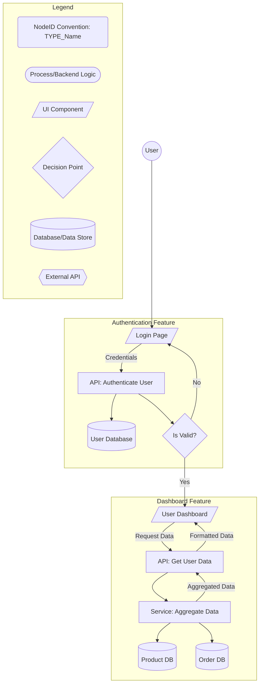

# kid - Architectural Flowchart

**Purpose:** This document contains the Mermaid flowchart defining the architecture, components (NodeIDs), and their primary interactions for this project. This visual map is the source of truth for all implementable components tracked in `kid_tracker.md`.

---

---

(This is a template showing a sample application structure. Replace the entire Mermaid content above with the specific flowchart for your project. 
